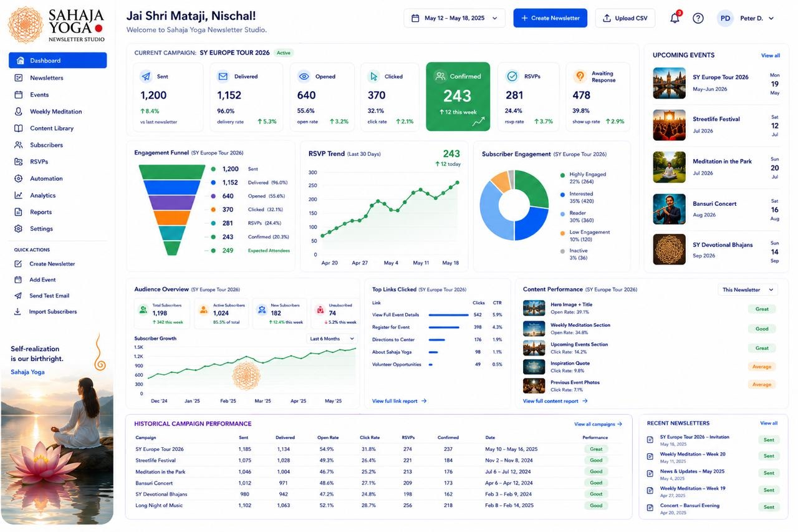
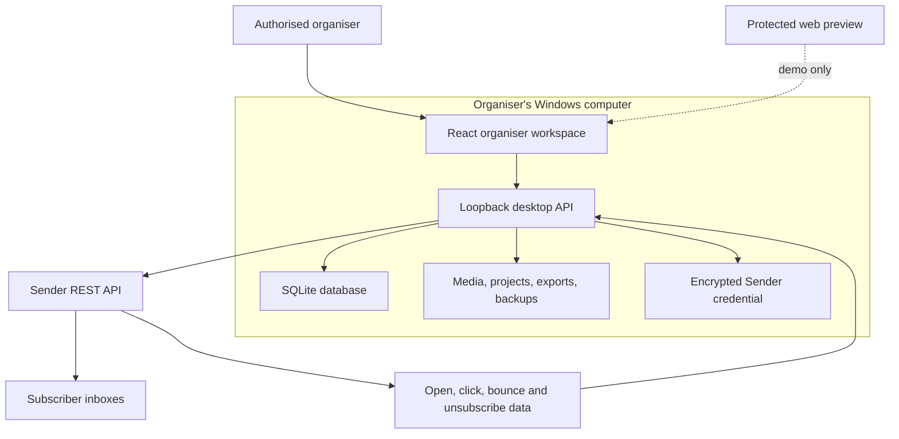
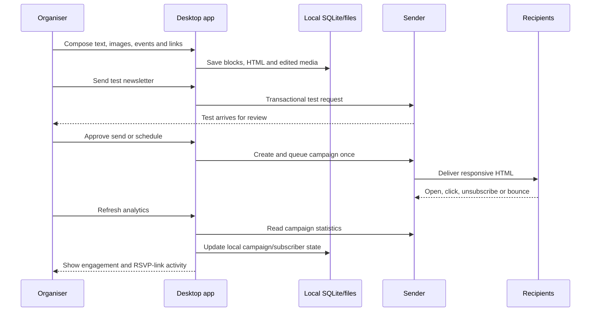
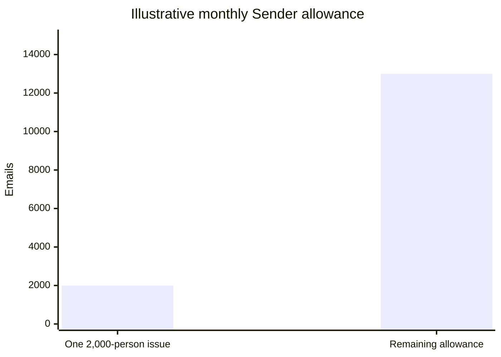
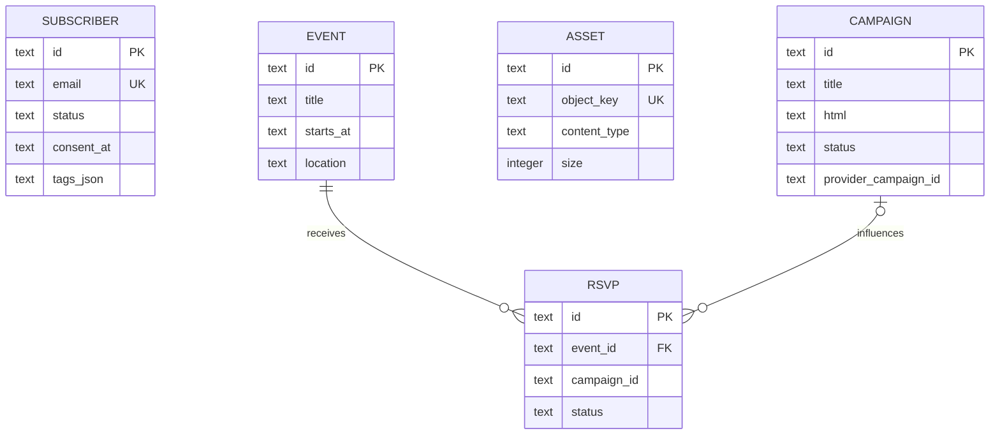

# Sahaja Yoga Newsletter Studio

> **[Open the shareable preview](https://sahaja-yoga-newsletter-studio.vercel.app):** The separate Vercel build includes the responsive studio, four newsletter masters, saved drafts, editable organiser profile, notifications and browser-owned image uploads. Phones have a visible Home / Editor / Newsletters / More navigation bar; More opens all workspace sections. See [Vercel preview deployment](docs/vercel-preview.md).

> **September 2026 update:** The home dashboard now restores the reference’s audience, engagement, link/content performance and campaign-history sections using saved records. Four source-informed templates, story/gallery editing, shared HTML preview, personalised greetings, notifications and reporting periods are described in [Newsletter design and dashboard integration](docs/newsletter-design.md). That document also identifies remaining delivery and legacy-screen limitations.


An organiser-only newsletter, event communication, RSVP, and engagement workspace for Sahaja Yoga teams.

The application gives a small group of experienced organisers a polished desktop workspace for preparing image-rich HTML newsletters, maintaining a subscriber list, sending through [Sender](https://www.sender.net/), and reviewing opens, clicks, bounces, unsubscribes, and RSVP-oriented link activity. Desktop operational data stays on the organiser's Windows computer. The original hosted edition remains protected; a separate Vercel preview is designed for sharing sample workflows and stores its drafts and photos in each visitor's browser. Neither preview holds Sender credentials.

> [!IMPORTANT]
> This is an administration tool for authorised Sahaja Yoga event organisers. It is not a public class finder, meditation guide, attendee portal, or subscriber-facing application.



## Table of contents

- [Newsletter design and dashboard integration](docs/newsletter-design.md)
- [Vercel preview deployment](docs/vercel-preview.md)
- [Project status](#project-status)
- [Why this exists](#why-this-exists)
- [Product principles](#product-principles)
- [Feature overview](#feature-overview)
- [Desktop, web, and mobile roles](#desktop-web-and-mobile-roles)
- [Architecture](#architecture)
- [Newsletter editor](#newsletter-editor)
- [Sender delivery integration](#sender-delivery-integration)
- [Analytics and RSVPs](#analytics-and-rsvps)
- [Local storage and backups](#local-storage-and-backups)
- [Data model](#data-model)
- [Windows setup](#windows-setup)
- [Sender account setup](#sender-account-setup)
- [Organiser workflow](#organiser-workflow)
- [Subscriber CSV format](#subscriber-csv-format)
- [Development setup](#development-setup)
- [Build and packaging](#build-and-packaging)
- [Repository structure](#repository-structure)
- [Security and privacy](#security-and-privacy)
- [Operational checklist](#operational-checklist)
- [Known constraints](#known-constraints)
- [Testing](#testing)
- [Content and image policy](#content-and-image-policy)
- [Roadmap](#roadmap)
- [Further reading](#further-reading)
- [License and use](#license-and-use)

## Project status

| Area | Status | Notes |
| --- | --- | --- |
| Organiser dashboard | Implemented | Saved campaign, audience, engagement, link/content performance, history and event sections; some older secondary screens remain demonstrations |
| Newsletter editor | Implemented | Block editing, desktop/mobile preview, image studio, HTML generation |
| Windows local backend | Implemented | Loopback-only HTTP API, SQLite, media store, project exports, backups |
| Sender integration | Implemented | Connection test, subscriber sync, test send, schedule, campaign send, analytics |
| Delivery safeguards | Implemented | Serialized calls, minimum request gap, retry handling, duplicate-send checks |
| Hosted web edition | Preview | Protected visual/demo surface; production delivery is deliberately desktop-only |
| Shareable Vercel build | Published through the owner's GitHub import | Browser-local drafts and uploads, sample analytics, no Sender credentials; mobile bottom navigation and full workspace drawer |
| Windows x64 ZIP | Verified | Portable package builds successfully; unsigned distribution requires normal Windows caution |
| Live Sender acceptance test | Required | Must be completed with the organisers' verified domain, group, and API token before real distribution |

The current release is `0.1.0`. The core product is operational, but a real newsletter should not be sent until the domain-verification and test-email checklist has been completed with the organisation's Sender account.

## Why this exists

The newsletter process combines writing, images, event details, photo albums, links, subscriber management, consent, delivery, and follow-up. General-purpose email tools can make precise image placement and consistent layout unnecessarily awkward—especially when an organiser needs to crop a photo, choose its focal point, adjust opacity, compare mobile and desktop versions, and preserve a reusable structure for the next issue.

Newsletter Studio puts that workflow into one focused application. A typical issue can contain:

- recent activities since the previous newsletter;
- event reports with text and embedded photographs;
- links to complete Google Drive photo albums;
- upcoming event invitations and registration links;
- weekly meditation information;
- selected articles from approved official sources; and
- a consistent greeting, closing, unsubscribe link, and Sahaja Yoga identity.

The master draft is based on the practical structure used by organisers such as Bettina rather than a generic marketing template.

## Product principles

1. **Organisers first.** The interface assumes its users already understand Sahaja Yoga and need efficient communication tools, not introductory explanations.
2. **No compromise on desktop.** The full editor, permanent navigation, campaign controls, and detailed panels are designed for a large screen.
3. **Mobile is genuinely usable.** The same application adapts to a compact review/editor experience that can be shared with the small organiser group through WhatsApp.
4. **Local ownership.** Subscriber records, drafts, media, exports, settings, and backups live on the organiser's machine.
5. **Provider boundaries are explicit.** Sender handles bulk delivery and provider-side interaction telemetry; the hosted preview never receives the production API token.
6. **Slow and safe is acceptable.** Contact synchronisation is deliberately paced. Avoiding API blocks and duplicate sends is more important than finishing immediately.
7. **Email compatibility beats visual tricks.** Generated newsletters use table-based HTML and inline styling suitable for common email clients.

## Feature overview

| Workspace | Capabilities |
| --- | --- |
| Dashboard | Campaign health, subscriber totals, RSVP trends, engagement segments, recent newsletters |
| Newsletter editor | Four templates, previous-edition copies, stories/galleries, image studio, email settings, responsive preview |
| Newsletters | Draft, scheduled, and sent campaign catalogue with performance summaries |
| Events | Event cards, date/time/location details, invitations, capacity, RSVP progress |
| Weekly meditation | Session structure and organiser planning surface |
| Content library | Approved official articles, meditations, and class resources |
| Subscribers | Search, status and engagement views, CSV import, Sender group synchronisation |
| RSVPs | Totals, confirmed/maybe responses, event-level follow-up context |
| Automations | Organiser-facing preparation for welcome, reminder, weekly, and follow-up flows |
| Analytics | Opens, clicks, delivery outcomes, unsubscribe events, RSVP-link interest |
| Reports | Campaign summaries suitable for organiser review |
| Settings | Sender token, group, verified sender identity, workspace location |

## Desktop, web, and mobile roles

| Edition | Purpose | Data | Email delivery |
| --- | --- | --- | --- |
| Windows desktop | Primary operational application | Local SQLite and folders | Enabled through Sender |
| Full web | Visual preview and product demonstration | Protected demo storage/data | Disabled by design |
| Mobile layout | Compact review and editing experience | Same runtime as the edition being viewed | Desktop only for production sends |

The optional web preview is available at [sahaja-newsletter-studio.nneupane1.chatgpt.site](https://sahaja-newsletter-studio.nneupane1.chatgpt.site). Access is controlled separately from this source repository.

## Architecture

The desktop application is an Electron shell around the same React organiser interface. It starts a private HTTP server bound to `127.0.0.1`, serves the compiled interface, and exposes only local application endpoints. The server is not reachable from other computers on the network.



### End-to-end newsletter flow



## Newsletter editor

The editor is the centre of the system. On wide screens it uses three columns: content and structure on the left, the live email canvas in the centre, and design/email properties on the right. On mobile, these tools move into a bottom toolbar and focused dialogs without reducing the desktop experience.

### Reusable blocks

| Block | Typical use | Editable properties |
| --- | --- | --- |
| Story | Connected event report and image | Date/place, title, paragraphs, left/right/above/below photo, caption, album or booking button |
| Gallery | Event photographs and album | Three independent photos or one composed 2–6 photo collage, alt text, captions, album link |
| Hero | Newsletter identity and lead story | Eyebrow, title, text, image |
| Heading | Section titles | Text, size, alignment, colour |
| Text | Reports, invitations, schedules, closing | Copy, alignment, colour |
| Image | Event photos and visual breaks | Source, alternative text, width, padding, radius, alignment |
| Button | Event, article, album, form, or RSVP links | Label, URL, alignment, colours, radius |
| Divider | Separate major sections | Colour |
| Spacer | Control vertical rhythm | Height |

Every block can be selected, moved up or down, duplicated, or deleted. Headings and paragraphs can be edited directly in the live preview.

### Image studio

The image workflow addresses the common pain points of composing newsletters in browser-only bulk-mail editors.

- Upload an original file or use an approved HTTPS image URL.
- Crop to original, square, 4:3 landscape, 16:9 wide, or 3:4 portrait.
- Drag the image to choose the focal point.
- Zoom from 100% to 300%.
- Adjust horizontal and vertical placement independently.
- Rotate in 90-degree steps.
- Flip horizontally or vertically.
- Tune brightness, contrast, saturation, and opacity.
- Set displayed width, surrounding padding, corner radius, and alignment.
- Export a new email-ready copy while preserving the original.

Edited local images are written to the application's media store and referenced by the draft. Export the edited PNG to the organisation’s approved public media hosting and replace the draft’s image URL before sending. The app blocks localhost and base64 images during desktop delivery; automatic provider media uploading is not implemented.

### Collage studio

The gallery properties include **Create one photo collage**. An organiser can select two to six original photographs and choose Feature left, Feature top, Balanced grid, or Film strip. The composition supports wide, landscape, square, and portrait canvases; adjustable gaps, rounded corners, and background colour; photo reordering; and independent zoom plus horizontal and vertical focal position for every photograph. Apply collage saves one PNG into the draft while preserving the gallery's album button. Export PNG produces the same composition for approved public media hosting.

### Master newsletter structure

The two supplied HTML newsletters are represented by named masters: **München Community Journal · Master** and **United Europe Tour · Master**. Tour Spotlight and Quiet Digest provide two additional professional variations. The German-language community master contains:

1. issue number and Sahaja Yoga hero;
2. greeting and opening note;
3. featured next event;
4. recent activities since the previous issue;
5. complete photo-album link;
6. upcoming events;
7. weekly meditation schedule;
8. current news or selected reading; and
9. organiser closing.

This is a starting structure, not locked content. Each issue remains fully editable.

## Sender delivery integration

[Sender](https://www.sender.net/) is the sole bulk-email provider in the desktop runtime. The application expects an organiser-owned Sender account, a verified sending identity, an API access token, and one subscriber group.

At the time this project was designed, Sender's published Free Forever allowance was up to 2,500 subscribers and 15,000 emails per month. A newsletter sent to 2,000 people four or five times a year fits comfortably inside that nominal allowance, but provider pricing and policies can change; verify the [current Sender pricing page](https://www.sender.net/pricing/) before operational use.

### Capacity example



### API safety controls

| Control | Implementation | Reason |
| --- | --- | --- |
| Single request queue | Sender calls are serialized | Prevents bursts from a small desktop client |
| Minimum request spacing | At least 300 ms between calls | Keeps contact synchronisation deliberately gentle |
| Retry limit | Maximum six attempts | Prevents endless retry loops |
| Rate-limit handling | Honours `Retry-After`; otherwise exponential backoff up to 30 seconds | Cooperates with provider throttling |
| Server-error handling | Automatic retry is limited to safe reads | Avoids blindly repeating state-changing requests |
| Campaign recovery | Unique local suffix plus remote campaign lookup after ambiguous creation | Recovers without creating a second campaign |
| Send guard | Local state and remote campaign status are checked before queueing | Reduces duplicate-dispatch risk |
| Ambiguous send recovery | Remote status is checked when a send call returns uncertainly | Distinguishes a failed request from an accepted campaign |
| Subscriber ceiling | Imports and synchronisation are capped at 2,500 | Matches the selected plan boundary |

Synchronising 2,000 individual contacts may take many minutes because each request passes through the queue. Campaign delivery itself is handed to Sender as a bulk campaign; the provider controls final mailbox delivery timing.

### Supported delivery actions

- **Send test:** sends to up to ten organiser addresses through Sender's transactional endpoint.
- **Schedule:** creates the remote campaign and submits a selected delivery time.
- **Queue newsletter:** creates or reuses one Sender campaign, confirms it is still a draft, and queues it once.
- **Refresh analytics:** reads campaign details, opens, clicks, hard/soft bounces, and unsubscribes.

## Analytics and RSVPs

Sender remains the source of truth for delivery events. The desktop dashboard converts the provider response into organiser-friendly metrics:

| Metric | Meaning in the studio |
| --- | --- |
| Sent | Messages accepted for the campaign |
| Delivered | Sent minus reported hard and soft bounces |
| Opened | Unique opens reported by Sender; privacy features can affect accuracy |
| Clicked | Unique tracked link clicks |
| Bounced | Hard and soft delivery failures |
| Unsubscribed | Provider unsubscribe events, also reflected in local subscriber status |
| RSVP-link clicks | Unique clicks whose destination resembles a registration or RSVP link |

RSVP-link analytics measure demonstrated interest, not necessarily a completed registration. A click is classified as RSVP-related when its destination contains terms such as `rsvp`, `anmeld`, `register`, Eventbrite, Google Forms, or similar registration patterns. Confirmed attendance should be taken from the actual event form or RSVP record.

## Local storage and backups

The desktop app discovers the current Windows user's Documents folder through Electron. It does not assume a hard-coded username or drive letter, so it continues to work when Documents is redirected to another location.

On first launch it creates:

```text
Documents/
└── Sahaja Yoga Newsletter Studio/
    ├── Database/
    │   └── newsletter-studio.db
    ├── Media/
    ├── Projects/
    │   └── <Newsletter name>/
    │       ├── newsletter.html
    │       └── newsletter.json
    ├── Exports/
    ├── Backups/
    │   └── newsletter-studio-YYYY-MM-DD.db
    └── settings.json
```

SQLite runs with write-ahead logging and foreign keys enabled. One dated database backup is created per day when the application starts, and the newest fourteen backups are retained.

The Settings screen shows the resolved workspace path and can open it in Windows Explorer.

## Data model

The desktop database is intentionally compact. It is suitable for the expected organiser group and subscriber volume without a separate database server.



Campaign content is stored as both structured JSON blocks and rendered HTML. This allows future editing without trying to reconstruct blocks from HTML while keeping a ready-to-send/exportable artifact.

## Windows setup

### For organisers using the packaged application

1. Download the Windows x64 ZIP produced by the release process.
2. Extract the complete folder to a stable location such as `C:\Program Files\Sahaja Yoga Newsletter Studio` or the user's Applications folder.
3. Run **Sahaja Yoga Newsletter Studio.exe**.
4. If Windows SmartScreen appears, confirm the file came from the trusted organiser who built it. The current package is not code-signed.
5. Open **Settings** and confirm the automatically selected workspace folder.
6. Enter the Sender configuration described below.
7. Import a small test list before importing the complete subscriber group.

Do not move individual files out of the extracted application folder. Move or copy the whole folder together.

### First-launch result

The app creates its folders and SQLite database automatically. No PostgreSQL/MySQL installation, cloud VM, Docker service, or manually configured C-drive path is required.

## Sender account setup

Sender's [current free plan](https://www.sender.net/pricing/) (checked 10 September 2026) includes 2,500 subscribers, 15,000 emails per month, one account seat, and required Sender branding. No credit card is required. Choose one designated organiser to dispatch through that account; the five Studio organisers do not receive five Sender seats.

1. [Create a Sender account](https://auth.sender.net/register?client_id=21&redirect_uri=https%3A%2F%2Fapp.sender.net%2F&response_type=code&scope=scope), select Free Forever, verify your email, and complete the organisation profile.
2. Open **Account settings → Domains → Add domain**. Verify a mailbox on your sending domain and add the exact DNS records Sender provides for SPF, DKIM, and DMARC. Follow the [official domain guide](https://www.sender.net/help/deliverability-compliance/spf-dkim-dmarc-setup/); merge an existing SPF record instead of creating a second one, and retain an intentional existing DMARC policy. DNS changes can take 24–48 hours.
3. Under **Subscribers → Groups**, create **Sahaja Yoga Newsletter**. Import subscribed contacts from Mailchimp into this group, map the email and name fields, and preserve unsubscribes and other suppressions. See [Sender's import guide](https://www.sender.net/help/subscribers-and-segmentation/importing-subscribers/).
4. Under **Settings → API access tokens**, create a token. In the **desktop** Studio's **Settings**, paste it, enter the verified sender identity, and save. Click **Load groups**, select your newsletter group, and save again. Do not paste the token into chat or the hosted preview.
5. Confirm the connection, then send to organiser test addresses. Check images, links, unsubscribe behaviour, and inbox placement before selecting the full group for a campaign send.

The app serializes API requests and backs off on rate limits. Sender controls bulk delivery timing; a deliberately slow client cannot guarantee that the provider will never reject a request.

The API token is encrypted with Electron's operating-system-backed `safeStorage` facility before being written to `settings.json`. The clear token is used only in memory for requests to Sender and is never saved in a draft, exported newsletter, or Git repository.

## Organiser workflow

### Dashboard appearance and starter content

The dashboard uses a pearl-blue gradient, translucent panels, and a persistent desktop sidebar. The reference logo is rendered at 70% of its original dimensions. The greeting and profile initials come from the active organiser, while the bell and date range use the workspace controls.

The campaign title is stored in the database. A one-time migration renames only untouched legacy placeholder drafts to **Music and Meditation**; it preserves sent campaigns and custom titles. New empty workspaces receive a starter draft. Five illustrated event planning entries come from the supplied September 2026 München newsletter. Their descriptions identify the source and ask organisers to confirm dates, times, and programmes before sending. These are editable planning records, not fabricated attendance or engagement results.

Upcoming events use each event's stored HTTPS image URL, with a local image fallback. The separate public-facing “From We Meditate” promotional card is removed. Engagement, audience, top links, content performance, and historical campaign sections continue to read the workspace analytics.

### 1. Prepare the audience

- Export or prepare the approved subscriber list as CSV.
- Confirm that every recipient has a valid consent basis.
- Import the CSV locally.
- Review active and unsubscribed counts.
- Synchronise the list to the configured Sender group; allow the process to finish at its deliberate pace.

### 2. Create the issue

- Open **Newsletter editor**.
- Load the master structure or open an existing draft.
- Replace all placeholder event dates, locations, copy, images, and URLs.
- Add recent activity summaries and a Google Drive album link where appropriate.
- Use the image studio for every photograph that needs cropping or tonal adjustment.
- Add descriptive alternative text to meaningful images.
- Check both 640 px desktop and 390 px mobile previews.

### 3. Review

- Save the draft to generate the responsive HTML.
- Check the subject, preheader, from name, and reply-to address.
- Send a test to at least two organisers using different email clients when possible.
- Verify every link, event date, image, unsubscribe link, and language detail.
- Confirm the intended Sender group before approving the final send.

### 4. Send and follow up

- Choose **Schedule newsletter** or **Queue newsletter**.
- Keep the application open until Sender confirms that the campaign was accepted.
- Refresh analytics after delivery begins.
- Treat RSVP-link clicks as interest and reconcile them with actual registration responses.
- Export or back up relevant reports before major list changes.

## Subscriber CSV format

The importer accepts records mapped to the following logical fields:

| Field | Required | Example | Notes |
| --- | --- | --- | --- |
| `email` | Yes | `organiser-test@example.org` | Normalised to lowercase and used as the unique contact key |
| `firstName` | No | `Anna` | Up to 100 characters |
| `lastName` | No | `Keller` | Up to 100 characters |
| `city` | No | `Ulm` | Useful for organiser segmentation |
| `language` | No | `de` | Defaults to `en` when omitted |
| `tags` | No | `weekly-meditation;ulm` | Stored as a list when provided by the import mapping |

Invalid rows without an email-like value are skipped. An import is capped at 2,500 contacts. The project contains example addresses only; never commit an operational subscriber file.

## Development setup

### Requirements

- Node.js `>=22.13.0`
- pnpm `11.19.0`
- Git
- Windows for native installer production; Linux/macOS can develop the interface and create supported packages subject to Electron Builder requirements

### Install

```bash
git clone https://github.com/nneupane1/sahaja-yoga-newsletter-studio.git
cd sahaja-yoga-newsletter-studio
corepack enable
pnpm install --frozen-lockfile
```

### Run the web development surface

```bash
pnpm run dev
```

### Run the desktop development surface

```bash
pnpm run desktop:dev
```

The desktop command compiles the renderer, starts Electron, creates the local workspace if necessary, and serves the interface on an automatically selected loopback port.

## Build and packaging

| Command | Output/purpose |
| --- | --- |
| `pnpm exec tsc --noEmit` | Type-check application source |
| `node --check desktop/main.mjs` | Check desktop backend syntax |
| `pnpm run build` | Build the hosted web/Sites worker |
| `pnpm run desktop:build` | Build the Electron renderer into `desktop-dist/renderer` |
| `pnpm run desktop:package:zip` | Create a Windows x64 ZIP in `desktop-release/` |
| `pnpm run desktop:package:win` | Create NSIS installer and ZIP on a compatible Windows/Wine build host |

Generated `dist/`, `desktop-dist/`, `desktop-release/`, databases, media, credentials, and environment files are excluded from Git.

The Windows executable is currently unsigned. For wider distribution, build on a controlled Windows machine and add a reputable code-signing certificate to the release process.

## Repository structure

```text
.
├── app/
│   ├── api/                  # Protected web-preview APIs
│   ├── rsvp/                 # RSVP response surface
│   ├── data.ts               # Demonstration content and navigation model
│   ├── editor-view.tsx       # Newsletter editor and image studio
│   ├── globals.css           # Brand, layout, and responsive styling
│   ├── layout.tsx            # Application metadata and shell
│   └── page.tsx              # Organiser dashboard and workspaces
├── components/ui/            # Reusable accessible interface primitives
├── db/                       # Hosted-preview Drizzle schema and database access
├── desktop/
│   ├── build/                # Windows icons
│   ├── index.html            # Electron renderer host
│   ├── local-schema.sql      # Local SQLite schema
│   ├── main.mjs              # Local API, storage, Sender and Electron lifecycle
│   └── renderer.tsx          # Desktop React entry point
├── drizzle/                  # Hosted-preview database migrations
├── hooks/                    # Shared responsive hooks
├── lib/                      # HTML rendering and server helpers
├── public/
│   └── images/               # Supplied and approved visual assets
├── scripts/                  # Reproducible install/build environment helpers
├── .openai/hosting.json      # Existing protected web-preview identity/bindings
├── package.json              # Scripts, dependencies and Electron packaging config
├── vite.config.ts            # Web/Sites build
└── vite.desktop.config.ts    # Desktop renderer build
```

## Security and privacy

### Implemented safeguards

- The desktop server binds only to `127.0.0.1` on a random available port.
- Renderer Node integration is disabled.
- Electron context isolation and renderer sandboxing are enabled.
- External links are opened by the operating system only for HTTPS URLs.
- Sender secrets are encrypted through OS-backed secure storage.
- Settings responses expose only whether a token exists, never the token itself.
- Local files are resolved beneath known application directories.
- Image uploads are restricted to image content types and 8 MB per file.
- Subscriber imports are bounded.
- URLs inserted into email HTML are restricted to HTTP/HTTPS.
- No real recipients, API tokens, databases, generated applications, or environment files are committed.

### Responsibilities of organisers

- Use only consented subscriber data and honour removals promptly.
- Restrict access to the Windows account and local workspace folder.
- Do not share database backups or CSV exports through public links.
- Rotate the Sender API token when a computer or Windows account is compromised.
- Verify the legal basis, privacy notice, retention policy, and imprint requirements applicable to the organising entity and recipient countries.
- Keep the subscriber list in Sender and the local database aligned after unsubscribes and bounces.

This repository is software documentation, not legal advice.

## Operational checklist

### Before every send

- [ ] Correct Sender group selected
- [ ] Verified from/reply-to identity
- [ ] Consent and unsubscribe status reviewed
- [ ] Subject and preheader approved
- [ ] Placeholder text removed
- [ ] Dates, times, locations, and names double-checked
- [ ] All images have permission for newsletter use
- [ ] Important images include alternative text
- [ ] Every button and text link tested
- [ ] Google Drive albums use the intended sharing permissions
- [ ] Desktop and mobile previews reviewed
- [ ] Test messages approved in at least two mail clients
- [ ] Unsubscribe link visible and functional
- [ ] Final recipient count plausible

### After every send

- [ ] Sender campaign status confirmed
- [ ] Hard/soft bounces reviewed
- [ ] Unsubscribes synchronised locally
- [ ] RSVP clicks reconciled with registrations
- [ ] Campaign report reviewed with organisers
- [ ] Daily backup present

## Known constraints

- Sender plan limits, branding requirements, endpoint behaviour, and prices can change.
- The Free Forever tier historically allows one account seat; the five organisers may need to share an agreed operational Windows account/process or move to a suitable plan.
- Open tracking is inherently approximate because mail privacy features, image blocking, and automated scanners can create false positives or negatives.
- A click on an RSVP link does not prove registration completion.
- Desktop delivery rejects local/base64 images. Use stable public HTTPS image hosting approved by the organisation and test the target inboxes.
- The desktop database is local to each installation. Five independent installations do not automatically merge their drafts or subscriber changes.
- The current executable is unsigned, so Windows may show a SmartScreen warning.
- Building the NSIS installer outside Windows requires a compatible Wine environment; the x64 ZIP is the currently verified portable distribution.
- Live Sender behaviour cannot be completely tested in source control because it requires the organisation's private token, verified identity, and real provider group.
- The hosted preview is not a production bulk-mail backend and intentionally rejects send requests.

## Testing

The checked-in project is validated with:

```bash
pnpm exec tsc --noEmit
node --check desktop/main.mjs
pnpm run build
pnpm run desktop:build
```

Before the first real campaign, complete a manual acceptance matrix:

| Test | Expected result |
| --- | --- |
| Fresh Windows launch | Workspace folders and database are created automatically |
| Restart | Existing drafts and settings remain available |
| Wrong Sender token | Clear connection error; token is not displayed |
| 20-contact test import | Valid contacts import; invalid rows are skipped |
| Repeated sync | Existing Sender contacts are updated rather than duplicated |
| Image edit | Applied copy preserves crop/focal point and original remains untouched |
| Gmail/Outlook/mobile test | Layout is readable and buttons/images behave correctly |
| Schedule | Local status and Sender status agree |
| Repeated send click | Existing queued/sent campaign is not dispatched again |
| Bounce/unsubscribe refresh | Local status and dashboard totals update |
| Backup restore rehearsal | Copied backup opens with expected campaigns/subscribers |

## Content and image policy

Repository examples use the supplied Sahaja Yoga identity/reference artwork and approved material from:

- [Shri Mataji — official archive](https://shrimataji.org/)
- [We Meditate](https://wemeditate.com/)

Organisers remain responsible for verifying permission, attribution, accuracy, and current event information before publication. Do not introduce material from unapproved regional sites merely because it appears in a search result.

No AI-generated image of Shri Mataji should be created or used. Use only authentic, approved photographs or supplied organisational assets for her image.

## Roadmap

The next production-hardening priorities are:

1. Run a live Sender sandbox campaign with organiser-only recipients.
2. Record a provider contract test fixture with personal data removed.
3. Add explicit CSV column mapping and import-error export.
4. Add campaign-level link labels/categories for stronger RSVP reporting.
5. Add a backup restore screen and integrity check.
6. Add signed Windows installer releases.
7. Decide whether the five organisers use one authoritative installation or require encrypted peer synchronisation.
8. Test HTML rendering across Gmail, Outlook desktop, Outlook web, Apple Mail, iOS Mail, and Android clients.

## Further reading

- [Sender pricing](https://www.sender.net/pricing/)
- [Sender API overview](https://api.sender.net/)
- [Create a Sender campaign](https://api.sender.net/campaigns/create-campaign/)
- [Send a Sender campaign](https://api.sender.net/campaigns/send/)
- [Schedule a Sender campaign](https://api.sender.net/campaigns/schedule-send/)
- [Sender click statistics](https://api.sender.net/statistics/clicks/)
- [Add a Sender subscriber](https://api.sender.net/subscribers/add-subscriber/)
- [Update a Sender subscriber](https://api.sender.net/subscribers/update-subscriber/)
- [Electron security guidance](https://www.electronjs.org/docs/latest/tutorial/security)
- [SQLite documentation](https://www.sqlite.org/docs.html)

## License and use

No open-source licence is currently granted. The source is published for the project owner's Sahaja Yoga organiser collaboration and review. Brand assets, photographs, supplied reference material, and third-party content retain their respective rights. Contact the repository owner before redistributing, relicensing, or using the project commercially.
