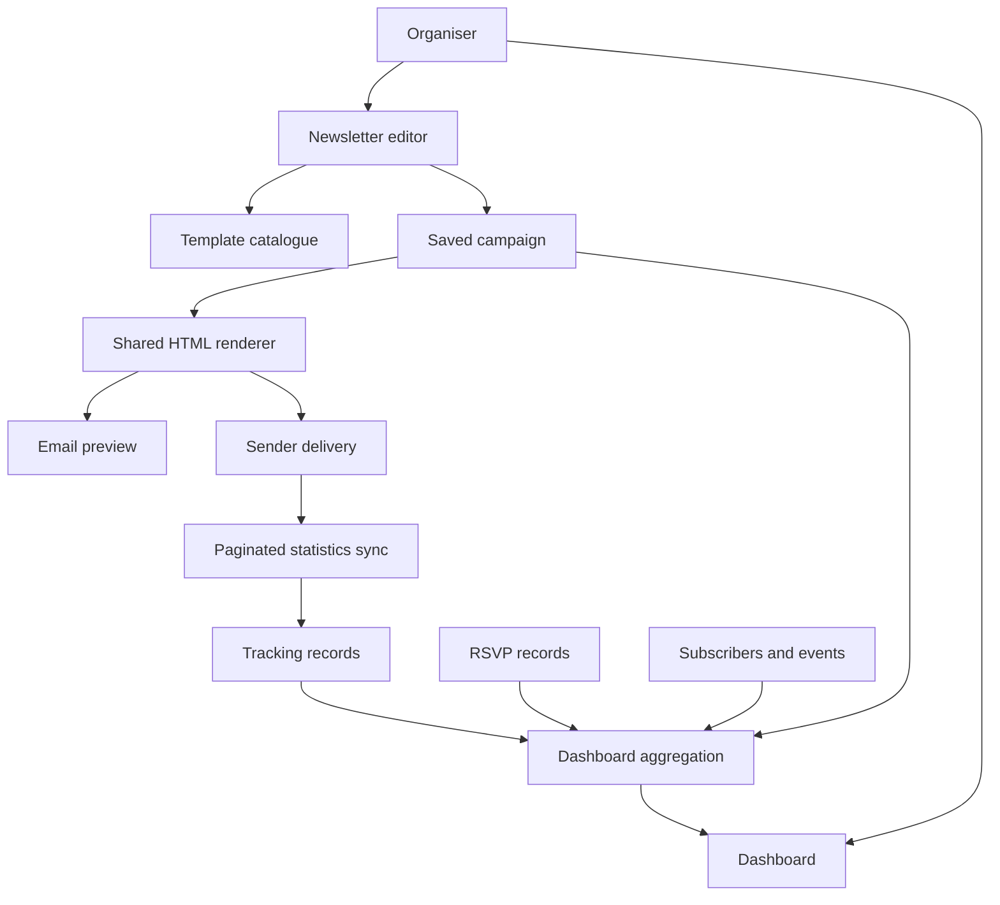

# Newsletter design and dashboard integration

The studio serves experienced Sahaja Yoga organisers. Its home page is an operational dashboard; the email itself is a warm message to subscribers. Those are separate audiences, with separate needs. The dashboard keeps the reference’s persistent logo and left navigation, while the email templates give stories, photography and invitations a calmer reading rhythm.

## Contents

- [Reference editions](#reference-editions)
- [Template families](#template-families)
- [Editorial and image controls](#editorial-and-image-controls)
- [Email rendering and motion](#email-rendering-and-motion)
- [Dashboard data](#dashboard-data)
- [Identity and workspace preferences](#identity-and-workspace-preferences)
- [Sender statistics](#sender-statistics)
- [Operational boundaries](#operational-boundaries)
- [Validation](#validation)

## Reference editions

The templates were informed by the actual HTML and image/link ordering in the [September community newsletter](https://www.meditationmuenchen.org/wp-content/uploads/2026/09/Sahaja-Yoga-Newsletter-05-2026-copy-01.html) and the [United Europe Tour special edition](https://www.meditationmuenchen.org/wp-content/uploads/2026/07/United-EU-Tour-2026-FINAL-copy-01.html). The design analysis used their HTML structure, text, dimensions, image locations and link destinations. It is not an inbox rendering certification.

| Reference | Editorial pattern to preserve | Improvement in the studio |
| --- | --- | --- |
| Community issue | Warm opening, upcoming highlights, weekly sessions, five retrospective reports, photographs, album links, news and closing | Event stories and galleries are independent reusable blocks, with more consistent spacing and typography |
| Tour special | One leading invitation, separate afternoon/evening programmes, nearby ticket links, video teaser, recurring sessions and news | A focused invitation template with programme cards and individual calls to action |
| Both editions | Live prose alongside real community photography | Text stays editable; images have placement, captions and alt text |
| Both editions | Large banners and posters, with widths reaching 800 px | A fluid 640 px email container and responsive stacking |
| Both editions | Repeated footer information and links | A consistent German contact/privacy/unsubscribe footer |

The community template preserves the five-report structure: Lange Nacht der Musik, Zamanand, International Yoga Day, the international festival in Aalen and the United Europe Tour. Each journal report retains its own three-photo gallery and album destination. The tour invitation uses its own banner, programme artwork and video thumbnail rather than pretending it is the same newsletter with another colour.

### Editorial cautions found in the source

The source files contain inconsistent June/July dates for the Europe Tour. The templates therefore mark the tour date for confirmation. They do not silently choose a date. Their historical content is a starting point, not a ready-to-send current schedule. The editor’s delivery review asks organisers to verify dates, draft copy, image credits and links.

The public HTML also contains raw Mailchimp subject/preview tokens. These are replaced by real subject and preheader fields in generated email. The excluded SahajaOnline link is not included in any new template. Image URLs found in the supplied editions remain on their original public CDN; that is asset provenance, not a Mailchimp sending integration.

## Template families

| Template | Use | Palette | Composition |
| --- | --- | --- | --- |
| München Community Journal · Master | A substantial newsletter based on the supplied latest issue | Navy, blue, white | Featured invitation, recurring sessions, five reports and collage-ready galleries |
| Tour Spotlight | A community issue with a prominent leading event | Burgundy, gold, warm white | Generous event feature followed by the full journal |
| Quiet Digest | A shorter overview | Deep teal, cool white | Alternating image/text stories with album buttons |
| United Europe Tour · Master | A special tour announcement based on the supplied tour issue | Plum, rose, warm white | Opening invitation, afternoon/evening cards, teaser and supporting updates |

The template picker loads its catalogue from the backend. The previous-newsletter list also loads saved records. Starting from an old edition gives every block a new identity and starts a separate draft. Unsaved changes in the current editable draft are saved before switching. Delivered or provider-connected editions are protected from accidental overwrite.

## Editorial and image controls

A story block keeps a title, date/place line, paragraphs, photograph, caption and optional button together. Its photograph can sit to the left, right, above or below the text. This supports a clear relationship between a report and the picture that explains it.

A gallery holds up to three independently placed photographs, each with its own image URL, alt text and caption. It also opens Collage Studio, which combines two to six originals into one PNG. Feature-left, feature-top, balanced-grid and film-strip layouts preserve the collage pattern seen in the source newsletters. Organisers can reorder photos, choose the featured photo, change canvas ratio, gaps, corners and background, and adjust each photo's zoom and focal point. Applying the collage leaves the gallery's album button beside the relevant event.

Image Studio provides crop ratios, focal position, zoom, rotation, horizontal/vertical flips, brightness, contrast, saturation and opacity. The preview and PNG export now share the same canvas transformation. Adjustments create a new file rather than overwriting the original. Export PNG provides a copy for the organisation’s media hosting.

The editor also retains heading, paragraph, standalone image, button, divider and spacer blocks. Blocks can be reordered, duplicated or removed. The structure list shows meaningful story titles instead of only repeating block types. Save status distinguishes a new template, unsaved edits and saved work. Navigating away through the app saves an editable draft first; closing or reloading with unsaved edits triggers the browser’s standard unsaved-work prompt.

## Email rendering and motion

One shared renderer generates the final preview, hosted saved HTML and desktop saved HTML. The editing canvas is an authoring surface; **Email preview** shows the complete generated document at desktop or mobile width.

The renderer uses presentation tables, inline typography/spacing, live text, escaped content and checked URL schemes. Multi-column stories and galleries stack on narrow screens. The footer includes Sender’s unsubscribe placeholder. Subject and preheader are actual editable fields.

Email content does not require JavaScript, animation, web fonts or hover effects to communicate its message. Existing editor/dialog transitions respect reduced-motion preferences. Photography, reading order, typography and whitespace provide the main visual impact. Some email clients ignore CSS filters and rounded corners; Image Studio can bake visual adjustments into the exported image. Actual inbox testing is still required before a live campaign.

## Dashboard data

The home page restores the reference’s dense working layout, including the following sections. None of the new home-page charts use the old demonstration counts.

| Section | Data source and meaning |
| --- | --- |
| Current campaign | Saved campaign selected within the organiser’s reporting period |
| Sent / delivered / opened / clicked | Saved counts and the most recently synchronized Sender statistics; unique people for opens/clicks |
| Confirmed / RSVPs / awaiting response | Confirmed and pending RSVP records associated with that campaign |
| Engagement funnel | The same campaign metrics used by the top cards |
| RSVP trend | Cumulative responses created within the selected period |
| Subscriber engagement | Mutually exclusive clicked, opened-only and no-tracked-interaction groups |
| Audience overview | Total, active and unsubscribed contacts; new subscribers in the selected period |
| Audience growth | New subscribers by month, using their saved creation dates |
| Top links clicked | Total recorded clicks plus unique click-through rate per link |
| Content performance | Link clicks attributable to a particular story/gallery/button; no invented per-image open rate |
| Historical campaign performance | Saved campaigns in the period, with tracked opens/clicks and confirmed records |
| Upcoming events | Future events from the database |
| Recent newsletters | Saved editions in the selected period, opening the actual editor record |

Unavailable data is displayed as an empty state or a dash. An unknown delivery count is not rendered as proof that nothing was delivered. The reporting period determines which campaigns appear and bounds the RSVP/new-subscriber views; delivery metrics remain lifetime totals for the selected campaign.

### Data flow



## Identity and workspace preferences

The hosted workspace derives identity from the signed-in organiser and enforces the existing organiser allowlist. A preferred full display name can be saved for that account. Nischal Neupane becomes **NN** and is greeted as Nischal; Bettina Muller becomes **BM** and is greeted as Bettina.

The desktop edition uses the current operating-system account and a profile preference. This does not add a separate in-app password system or synchronize five computers. Organisers sharing one Windows account would share that workspace/profile.

The date button opens a real date-range editor with quick ranges. Preferences are persisted per user. Notifications are derived from saved campaign activity and upcoming events. Opening one takes the organiser to its campaign or events; read state is persisted. The original logo crop and sidebar remain, with the logo section reduced by approximately 30% from the previous implementation.

## Sender statistics

The integration follows the official [click statistics](https://api.sender.net/statistics/clicks/), [open statistics](https://api.sender.net/statistics/opens/), [campaign details](https://api.sender.net/campaigns/get-one/) and [pagination](https://api.sender.net/pagination/) response shapes.

Statistics requests use the existing sequential throttled client. Every page is read, rather than assuming a request for 2,500 items returns the complete report. Pagination constructs relative paths on the trusted Sender API host; arbitrary response hosts never receive the API token. An empty intermediate page or page-limit failure preserves the previous report rather than labelling an incomplete result as complete.

A campaign’s refresh requests are coalesced and recent reports are cached for one minute. Ordinary dashboard loads only read local/saved data. Retrieved interactions are deduplicated before persistence. A database transaction keeps report metrics, link events and subscription changes consistent.

A repeated destination used in several content positions cannot always be attributed to one block using the provider response alone. Such clicks appear under a shared-link entry rather than being credited independently to every block. Open tracking is approximate, and booking-link interest is not attendance confirmation.

## Operational boundaries

- The hosted edition remains an organiser preview with persistent records. Sender credentials and live delivery remain in the desktop runtime.
- Newly uploaded or edited local images must be given publicly accessible image URLs before real email delivery. The app now blocks localhost/base64 image delivery instead of sending an unreliable email. Export the PNG, upload to the organisation’s media hosting, and paste its public HTTPS URL. Automated Sender media uploading is not implemented.
- An offline desktop cannot receive internet callbacks. Sender retains its own campaign activity for later synchronization. Separate RSVP forms must provide recorded responses; a click on Eventbrite is not automatically an Eventbrite booking.
- The new dashboard is backed by saved data. Some older secondary screens still contain demonstration content or browser-local state; this change does not certify the whole legacy application as production-complete.
- No real email was sent during development. There has been no Gmail/Outlook/Apple Mail rendering certification or installed-Windows end-to-end certification for this change.
- The existing public preview URL is not updated by a source-only GitHub push. Publishing and installer distribution are separate steps.

## Validation

The focused test suite checks account names/initials, invalid date handling, notification read state, campaign isolation and RSVP semantics against both local SQLite and the hosted schema, safe HTML generation for all four templates, gallery preservation, sequential pagination and unique-person counting. TypeScript, web compilation and desktop renderer compilation are also run before committing the change.

```bash
node --test tests/workspace.test.mjs
pnpm exec tsc --noEmit
node --check desktop/main.mjs
pnpm run build
pnpm run desktop:build
```
