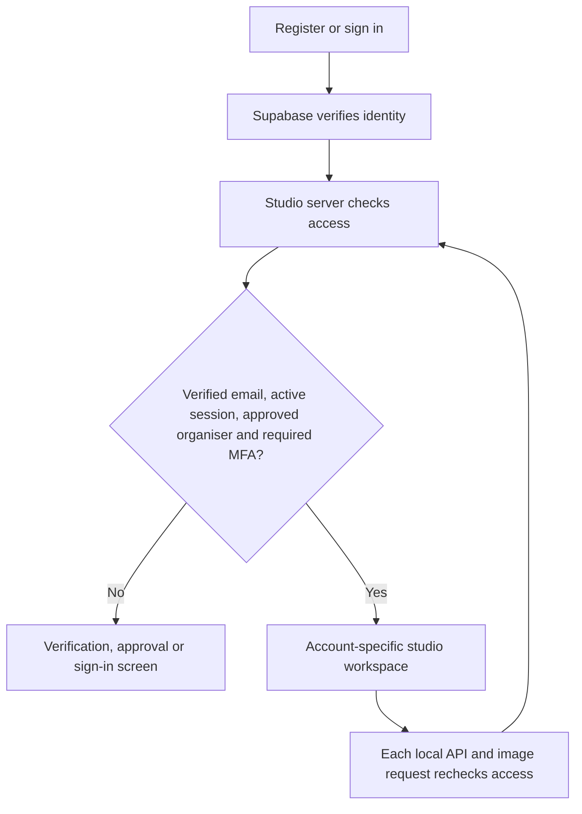

# Organiser registration and login

This branch adds an account gate to the Vercel web version of Newsletter Studio. Visitors can register, verify their email, sign in, recover a password and optionally enable two-step verification. Only approved organisers can enter the studio. Approval is checked on the server; changing browser data or a profile name does not grant access.

**This is a GitHub-only update. It has not been deployed.** The existing public preview remains unchanged. The branch sets `git.deploymentEnabled` to `false` in `vercel.json`, so publishing this branch does not request an automatic Vercel deployment. Do not merge or enable deployments until the owner requests the next deployment and the configuration below is ready.

## Contents

- [What is included](#what-is-included)
- [Provider and cost](#provider-and-cost)
- [Set up the account service](#set-up-the-account-service)
- [Local development](#local-development)
- [How access is checked](#how-access-is-checked)
- [Data and account separation](#data-and-account-separation)
- [Testing](#testing)
- [Later deployment checklist](#later-deployment-checklist)
- [Troubleshooting](#troubleshooting)

## What is included

| Feature | Behaviour |
| --- | --- |
| Registration | Email, full name and password; confirmation email before workspace access |
| Login | Supabase-managed email/password authentication; Google OAuth can be enabled |
| Approval | Exact verified email must match the server's list of at most five organisers |
| Personalisation | Greeting, name and initials come from the signed-in account |
| Recovery | Request a reset email, follow the link, choose and confirm a new password |
| Account settings | Update display name, change password, enrol an authenticator app, sign out other devices |
| Two-step verification | TOTP setup with QR code; server requires an AAL2 session once a verified factor exists |
| Logout | Save prompt, durable studio-session revocation, provider logout and credential removal |
| Private local projects | Separate browser database, image access and preferences for each account |
| Failure handling | Missing configuration, unavailable provider or missing migration keeps the studio locked |

Registration is an application for organiser access, not an automatic membership grant. Subscribers must not be added to the organiser approval list. Display names are editable labels; verified email and provider user ID determine access.

## Provider and cost

[Supabase Auth](https://supabase.com/docs/guides/auth) handles passwords, verification, recovery and OAuth. The studio never stores a password or implements its own password hashing. Supabase supports redirecting back to the existing Vercel address, so this integration does not require buying a web domain. [Redirect configuration](https://supabase.com/docs/guides/auth/redirect-urls)

Supabase has a free plan, and [TOTP authentication is free](https://supabase.com/docs/guides/auth/auth-mfa/totp). Check the project's [current plan and quotas](https://supabase.com/pricing) when creating it. This branch does not provision a paid service or enter payment details. Free-plan inactivity and availability limits still apply; if the provider is unavailable, the studio locks rather than allowing anonymous entry.

**Authentication email needs its own setup.** Supabase's default email service is for testing, sends only to project team members and currently has a low hourly limit. It is not enough for Bettina's ordinary registration. Configure an existing organisation SMTP mailbox or a suitable transactional provider before inviting organisers. Use that provider's verified sender and check its costs and limits. SMTP credentials belong in Supabase, never in GitHub or the browser. Do not disable email confirmation to work around delivery problems. [Official SMTP guidance](https://supabase.com/docs/guides/auth/auth-smtp)

Sender remains the existing bulk-newsletter delivery integration. This authentication change neither replaces Sender nor enables real newsletter sending in the Vercel preview. Signup and password-reset messages are separate from newsletters.

## Set up the account service

### 1. Create and configure Supabase

Create a project in [Supabase](https://supabase.com/dashboard). Choose the appropriate region and keep the database password in your password manager. In Authentication settings:

- Enable email/password signup and **Confirm email**.
- Set the server password minimum to **12 characters**. The form also checks this, but the provider setting is the enforcement point for direct API calls.
- Keep secure password changes and secure email changes enabled. Enable additional password protections available in the selected plan.
- Configure SMTP and send a confirmation and reset email to a real test address.
- Retain provider rate limits. Enable Cloudflare Turnstile protection before opening public registration: put its secret in Supabase and its public site key in `VITE_TURNSTILE_SITE_KEY`. The form includes the matching challenge and handles expired tokens.
- Keep anonymous sign-in disabled. Do not grant organiser access through user-editable metadata.

No account-service credentials have been created or configured by this code update.

### 2. Set exact redirect URLs

For the later live version, set the Site URL to:

```text
https://sahaja-yoga-newsletter-studio.vercel.app
```

Allow these exact redirect URLs:

```text
https://sahaja-yoga-newsletter-studio.vercel.app/
https://sahaja-yoga-newsletter-studio.vercel.app/reset-password
```

For development, also allow `http://localhost:5173/` and `http://localhost:5173/reset-password`. If using `127.0.0.1`, configure those exact URLs instead and use that host consistently. Avoid broad wildcard redirects for production.

Keep the standard Supabase confirmation and password recovery templates using their confirmation link. The app uses PKCE. Open confirmation and recovery links in the same browser that requested them; another tab is supported. A different browser or device will not have the PKCE verifier. Request a fresh link from that browser if necessary.

### 3. Apply the migration and configure the app

Run [the session migration](../supabase/migrations/202609130001_studio_sessions.sql) in the Supabase SQL Editor. It creates two restricted RPC functions and a session-revocation table. It does not create or modify newsletter/subscriber tables. The app needs no service-role key.

Use [the environment example](auth.env.example). For the later Vercel deployment, configure:

| Variable | Visibility | Value |
| --- | --- | --- |
| `VITE_SUPABASE_URL` | Public | Project URL, `https://<ref>.supabase.co` |
| `VITE_SUPABASE_PUBLISHABLE_KEY` | Public | Publishable key, or the project's legacy anonymous key; never service-role |
| `STUDIO_APP_ORIGIN` | Server | Exact canonical studio origin, without a path |
| `STUDIO_ORGANISER_EMAILS` | Server | Comma-separated verified organiser emails, maximum five |
| `VITE_GOOGLE_AUTH_ENABLED` | Public | `false` until Google is configured; then `true` |
| `VITE_TURNSTILE_SITE_KEY` | Public | The site key paired with Supabase's configured CAPTCHA secret |

Add Nischal's and Bettina's actual email addresses to `STUDIO_ORGANISER_EMAILS`. Example addresses in the repository do not approve real people. The list is case-insensitive and exact-match. Adding or removing an email requires changing the server environment and redeploying later; it cannot be changed by a registrant. An empty list deliberately approves nobody. More than five entries is a configuration error and locks access.

### 4. Optional Google sign-in

Follow [Supabase's Google setup](https://supabase.com/docs/guides/auth/social-login/auth-google). Configure Google's OAuth consent screen, client and callback URI exactly as Supabase specifies. Keep the Google client secret in Supabase. Then enable `VITE_GOOGLE_AUTH_ENABLED` and rebuild. No Google secret is included in the app.

Google sign-in does not bypass organiser approval or an enrolled authenticator factor. Email/password registration works independently; you do not need Google OAuth to register using your own email address.

## Local development

Use Node 22.13 or newer and the repository's pinned pnpm version. Keep its existing dependency supply-chain policy enabled.

```bash
pnpm install --frozen-lockfile
cp docs/auth.env.example .env.local
# Fill in the real project URL, public key and approved emails in .env.local.
pnpm dev:auth
```

Open `http://localhost:5173`. This command serves both the Vite application and the actual Node authentication handlers. Running the old public preview with an ordinary static file server is insufficient for authentication.

```bash
pnpm test:auth
pnpm exec tsc --noEmit --incremental false
pnpm share:build
pnpm desktop:build
```

The existing desktop and original Sites builds keep their previous entry points. This change secures the Vercel web version; it does not claim to add a new Supabase login to the native desktop app or replace the original Sites authentication.

## How access is checked



The browser obtains a provider access token. `/api/auth` asks Supabase for the authenticated user and calls the session-status RPC using that same token. It checks the live session, durable revocation record, verified email, approval list and authenticator assurance. The server does not trust `getSession()` as proof of identity. [Remote user verification](https://supabase.com/docs/reference/javascript/auth-getuser)

The session RPC uses the authenticated JWT's user and session IDs, takes no caller-supplied account parameters and has a fixed SQL search path. Anonymous execution and direct reads/writes of the revocation table are denied. A logout records revocation before provider logout; subsequent studio API requests reject that session even while the old access token has time remaining. Existing open screens recheck on focus and every 30 seconds, and every local API operation checks before accessing local records. Already displayed content cannot be recalled from a person's screen.

Private API responses are not cached. Mutating auth requests require the canonical origin, and cookie-only requests do not authenticate. Browser-uploaded images are served only after the worker obtains a token over a private message channel and confirms that the server identity matches the requested image account. No token is stored by the worker.

## Data and account separation

Projects and uploaded photos remain in IndexedDB on the current browser/device, scoped by the provider's stable user ID. Browser preferences use the same account scope. Signing in as Bettina does not load Nischal's drafts. Display-name changes cannot change the data scope.

Authentication credentials use tab-scoped session storage. The short-lived PKCE verifier alone is shared between tabs to support email links. Signing out removes the session; closing a tab removes its session-storage access, subject to browser session-restoration behaviour. Authentication does not encrypt the local project database against someone who controls the computer or browser developer tools. Use separate OS accounts on shared machines and normal device security.

The old public-preview database is not automatically assigned to the first person who registers. It is preserved separately. Export drafts from the old preview before upgrading if they need to be transferred; do not clear browser data before backing them up. The app does not yet provide shared editing or synchronise one organiser's local projects to another device. Account registration is shared through Supabase; newsletter projects remain local.

## Testing

Automated tests exercise server policy, the official Supabase SDK's transport integration with mocked provider responses, the image worker and browser API guard. The exact SQL migration is also executed in PGlite's PostgreSQL engine, including role permissions, revocation, expired/missing sessions and MFA state. Existing newsletter preview regression tests remain included.

| Scenario | Expected result |
| --- | --- |
| No token, invalid token or provider rejects an expired token | Sign-in required |
| Unverified email or unapproved organiser | No workspace access |
| Metadata claims administrator or another approved email | No privilege granted |
| Enrolled authenticator, password-only session | Six-digit code required |
| Revoked, banned, expired or missing session | Access denied |
| Provider outage or missing migration | Locked with a retry message |
| Another account's image URL | No local image database access |
| Anonymous SQL RPC or direct revocation-table query | Permission denied |
| Attempt to revoke another user's session | No cross-account revocation |
| Browser bridge disposed while authorising | No subsequent local data access |
| Existing editor and preview operations | Existing regression tests pass |

These automated tests do not send real emails or validate a configured Google application. Actual signup email delivery, recovery links, Google consent, CAPTCHA and authenticator pairing must be checked with the owner's provider configuration before the later deployment. Passing tests is not an independent security audit or a GDPR certification.

Browser checks at mobile and desktop sizes verified the sign-in, registration and recovery screens without horizontal overflow or JavaScript errors. With mocked provider responses, an unapproved account stayed outside; an approved Bettina account entered with her own greeting and initials, opened account settings and signed out successfully. These UI checks are separate from real provider acceptance testing.

## Later deployment checklist

When the owner explicitly requests deployment:

1. Configure Supabase, SMTP, redirect URLs, CAPTCHA and the migration. Add the exact approved organiser emails and environment values.
2. Complete a real signup, confirmation, login, reset-password and logout cycle locally using that project. Test an unapproved account and authenticator verification too.
3. Review the GitHub branch. Deliberately remove or change `git.deploymentEnabled: false` only when ready to deploy. Use the intended canonical Vercel origin.
4. Deploy and repeat acceptance checks in a fresh browser. Nischal and Bettina each register with their own email; neither needs a Supabase dashboard account. Verify their greetings and initials, separate drafts, image access, logout and blocked anonymous entry.

Do not put real subscriber records in the shared public preview. This branch does not turn its browser-local newsletter operations into a shared cloud backend or enable Sender delivery on Vercel.

## Troubleshooting

| Symptom | Check |
| --- | --- |
| Account access is being prepared | Public Supabase build variables were not supplied |
| Account access temporarily unavailable | Server variables, Supabase availability and session migration |
| Waiting for organiser approval | Exact verified email is missing from the server list |
| No confirmation email | SMTP, spam folder, CAPTCHA, rate limit and redirect configuration |
| Confirmation or reset link fails | Same browser as request, fresh link, exact redirect allowlist |
| Google button absent | Optional Google flag is false |
| Images unavailable after login | Worker activation, network connection, same account and browser/device |
| Lost authenticator | Owner verifies identity independently, then resets the factor in Supabase |
| New branch did not deploy | Expected: automatic Git deployment is disabled on this branch |

Review Supabase's authentication audit logs for provider-side problems. Never paste passwords, access tokens, refresh tokens, SMTP credentials or OAuth secrets into an issue or screenshot.
