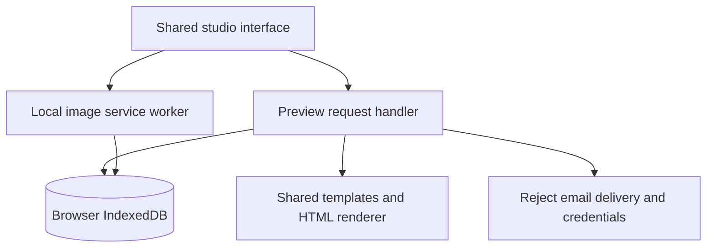

# Shareable Vercel preview

This build lets organisers explore Newsletter Studio on a laptop or phone through a standard Vercel address. It uses the existing studio components and newsletter renderer, including both source-informed master templates and the collage editor. It is a demonstration workspace for the organising team, not an attendee website.

## Deployment status

The preview is published at [sahaja-yoga-newsletter-studio.vercel.app](https://sahaja-yoga-newsletter-studio.vercel.app). The owner imported this repository through the Vercel dashboard after granting its GitHub integration access. GitHub reported a successful Vercel deployment and the owner confirmed the URL opens. The connected assistant's Vercel workspace access previously returned `403 Forbidden`; Git-linked updates can deploy independently of that connection.

| Setting | Value |
| --- | --- |
| Vercel workspace | `nischal-neupanes-projects-2bf96b96` |
| Confirmed workspace ID from the Vercel error | `team_X8G4JWGaqLto5qbg5flOKu5c` |
| Separate newsletter project | `sahaja-yoga-newsletter-studio` |
| Published address | `sahaja-yoga-newsletter-studio.vercel.app` |
| Repository | `nneupane1/sahaja-yoga-newsletter-studio` |
| Source root | Repository root |
| Framework preset | Other |
| Build command | `npm run share:build` |
| Output directory | `share-dist` |
| Required service credentials | None |

The existing Munich public website is a different project and must not be renamed, replaced or relinked. No paid domain, database or email service is needed by this static preview. Account plan eligibility and usage limits still apply.

## What visitors can do

| Workflow | Preview behaviour |
| --- | --- |
| Dashboard | Saved campaign selection, date filters, five sample event images, history and link/content sections |
| Engagement charts | Clearly identified example figures for the SY Europe Tour sample; new drafts have zero deliveries |
| Newsletter templates | Four masters; the journal and invitation follow the two supplied newsletters |
| Saved editions | Open browser-saved drafts or start a new edition from a sample |
| Editor | Existing block, image, collage, HTML preview and export tools |
| Draft saving | Persistent IndexedDB storage in the current browser |
| Photos and collages | Uploaded PNG, JPEG, WebP and GIF files are saved locally in IndexedDB; maximum 15 MB per image |
| Profile | Editable preview name drives greeting and initials; this is not authentication |
| Bell and date controls | Read notifications and reporting preferences persist in the current browser |
| Subscriber import | Imports into the isolated preview; use sample contacts when demonstrating |
| Sending and Sender settings | Rejected by the preview API; use the desktop app for actual delivery |
| Legacy secondary screens | Existing demonstrations remain demonstrations; see the design document for limitations |

Each friend has a separate browser workspace. Their changes do not synchronise to another organiser, the desktop app or the protected hosted edition. Clearing site data removes preview records. Browser storage may also be evicted; do not use this preview as the only copy of an important newsletter. Export a draft before moving to another device.

## How the build works

### Navigation on phones

Below 768 px, the Sahaja Yoga logo stays visible in the header and links back to the dashboard. The home page displays every workspace section in a compact three-column grid above the dashboard, without requiring a menu tap. A fixed Home / Editor / Newsletters / More bar remains available across views. More opens a modal drawer containing every desktop navigation entry. The drawer traps keyboard focus, supports Escape and outside-click dismissal, scrolls independently and closes on navigation. Changing to a desktop-sized viewport closes the mobile drawer.

Content has extra bottom spacing, and the bar respects the phone's safe area. The bar hides while a writing field has focus. Editor-specific Add / Blocks / Design / Settings controls sit in the phone's top editor toolbar so there are no competing fixed bottom bars. Switching views uses the existing draft-save guard. The desktop sidebar retains its full width and layout.



`share/renderer.tsx` initialises local storage and the image service worker before mounting the shared application. Same-origin API requests use `share/api.mjs`; they do not reach the operational backend. The service worker serves only images uploaded by that browser. Remote newsletter images retain their original URLs.

API writes are serialised, and Web Locks coordinate tabs where supported. The persistence wrapper waits for IndexedDB transactions to finish before reporting success. Uploaded image URLs under `/api/assets/` work within this browser only. They are **not** public image hosting for delivered email; use accessible HTTPS images before real distribution.

## Build and publish

Install the repository's locked dependencies using its normal development setup, then run:

```bash
npm run share:build
node --test tests/share-preview.test.mjs
```

For Git-linked Vercel deployment, import the newsletter repository into the named workspace as a separate project. The root `vercel.json` selects the preview build and output. No Sender token or production database variables should be added. Review the account's deployment protection setting to make sure the intended recipients can open the production address.

The legacy direct-file deployment helper uses the earlier proposed project name `newsletter-sahajayoga-munich`. Do not use it for routine updates to the published project, because that would target a different project. Routine updates should use this repository's Git-linked deployment. If explicitly setting up that separate project, build locally and generate the request:

```bash
node scripts/vercel-static-payload.mjs
```

The script emits a production deployment request containing only the compiled public files and static hosting configuration. It explicitly targets the newsletter project and supplied workspace. It never includes desktop databases, local settings, environment files or source authentication code. Inspect the result through Vercel until it reports `READY`; only then treat its assigned address as live.

## Verification and remaining checks

Automated tests cover draft persistence through a fresh API instance, profile initials, preferences, four master templates, upload persistence, unsafe upload-format rejection, contact deduplication, dashboard composition and refusal to send or store provider credentials. TypeScript checking and the Vite production build pass.

These tests use a storage adapter and do not replace browser verification of IndexedDB and service-worker behaviour. The owner confirmed the production URL opens. Detailed browser checks and live image-upload verification remain pending; the automated browser binary could not be downloaded in the build environment. No real email was sent.
